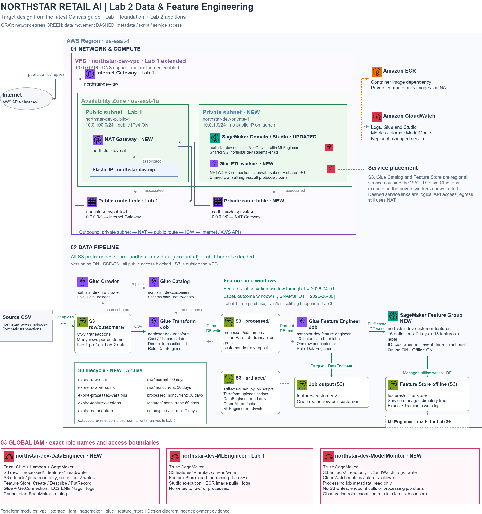

# NorthStar AI Platform — Lab 2: Data & Feature Engineering

This CS 401R repository extends the Lab 1 platform with a private-subnet data
pipeline. Raw customer transactions land in S3, Glue discovers and cleans them,
and a second Glue job produces customer features and churn labels for SageMaker
Feature Store. Lab 3 can consume these features for model training.

Continue using this repository for later labs. Infrastructure is managed with
Terraform; the Glue scripts implement the data transformations.

## Architecture and repository layout



The [data lineage diagram](docs/lab2-data-lineage.png) traces payloads, formats
and writer identities. Editable draw.io sources are available for the
[architecture](docs/lab2-architecture-diagram.drawio) and
[lineage](docs/lab2-data-lineage.drawio). A
[Chinese architecture explanation](docs/lab2-architecture-explained.md) is also included.

| Path | Responsibility |
|------|----------------|
| `infrastructure/modules/vpc/` | VPC, public/private subnets, routing, Internet Gateway, NAT Gateway and security groups |
| `infrastructure/modules/storage/` | Versioned, encrypted data bucket, public-access blocking, prefix markers and lifecycle rules |
| `infrastructure/modules/iam/` | MLEngineer, DataEngineer and ModelMonitor roles and their scoped policies |
| `infrastructure/modules/sagemaker/` | SageMaker Domain and MLEngineer user profile; the dev Domain uses the private subnet with `VpcOnly` |
| `infrastructure/modules/glue/` | Catalog database, raw crawler, private network connection, uploaded job scripts and both ETL jobs |
| `infrastructure/modules/feature_store/` | Customer Feature Group, online store and S3 offline store configuration |
| `infrastructure/environments/dev/` | Connects all six modules for real AWS deployment |
| `infrastructure/environments/local/` | LocalStack checks of VPC, storage and IAM; excludes Glue and SageMaker and disables NAT/lifecycle rules |
| `glue-scripts/transform.py` | Type/date conversion, missing-value imputation and transaction deduplication |
| `glue-scripts/feature_engineer.py` | Customer aggregation, loyalty tier, churn proxy, holdout label and Feature Store ingestion |
| `scripts/verify-lab2.sh` | AWS resource checks and data-quality checks on downloaded Parquet |
| `scripts/audit-lab2-parquet.py` | Full local snapshot comparison against an independent raw-CSV reference, including offline Feature Store records |
| `scripts/teardown-lab2.sh` | Course cleanup script for Terraform resources and service-created leftovers |
| `docs/` | Data contract, diagrams and recorded deployment/verification evidence |

Resource names are derived from `project` and `environment`. Defaults are
`northstar`, `dev` and `us-east-1`; the data bucket also includes the AWS account ID.
Glue ETL workers run in the private subnet and use the DataEngineer role. The
crawler also uses DataEngineer. Feature Store assumes that role for offline
S3 writes. Manual raw-data uploads use the operator's authenticated IAM identity.

## Prerequisites

- Terraform >= 1.5 and AWS CLI v2, available as `terraform` and `aws`
- An authenticated AWS profile with permission to provision the lab resources
- Bash (Git Bash on Windows), plus `python3` with `pandas` and `pyarrow` for verification
- Docker Compose for the required Task 1 LocalStack infrastructure checks

Commands below run from the repository root in **Bash**, not PowerShell.
Keep credentials in your AWS profile or process environment. Do not commit AWS
keys, `.env`, `*.tfvars`, state files or saved Terraform plans.

On the current Windows workstation, Terraform is kept on D: outside this repo.
If these existing tools are not on PATH, use:

```bash
export PATH="$(cd ../.tools/terraform && pwd):/c/Program Files/Amazon/AWSCLIV2:$PATH"
```

The verification script invokes `python3` by name. Confirm that this command
uses your intended Python environment and can import both libraries before
running verification. Glue supplies Spark and its own Python runtime; do not
run the ETL scripts directly with ordinary local Python.

## Deploy the infrastructure

Set the region and check the active AWS identity before deploying:

```bash
set -euo pipefail
export AWS_DEFAULT_REGION=us-east-1
export AWS_PAGER=""
aws sts get-caller-identity
ACCOUNT_ID=$(aws sts get-caller-identity --query Account --output text)
```

If this account has not completed the Lab 1 remote-state setup, run
`bash scripts/bootstrap-state.sh` once. It provisions the separate state bucket
and DynamoDB lock table. The data bucket and state bucket have different purposes.

Initialize and validate the dev configuration. The backend bucket override
allows a fresh clone to use the authenticated account's state bucket rather
than the account-specific bucket recorded in `backend.tf`:

```bash
terraform -chdir=infrastructure/environments/dev init \
  -backend-config="bucket=northstar-tfstate-${ACCOUNT_ID}"
terraform fmt -check -recursive infrastructure
terraform -chdir=infrastructure/environments/dev validate

# Keep binary plans outside the public Git repository
mkdir -p ../.tools/dev-validation
PLAN_FILE="$(cd ../.tools/dev-validation && pwd)/lab2-reproduce.tfplan"
terraform -chdir=infrastructure/environments/dev plan -out="$PLAN_FILE"
terraform -chdir=infrastructure/environments/dev show "$PLAN_FILE"
```

Review additions, changes and any replacements in the plan before applying it.
For this pipeline, `enable_nat_gateway` must be `true`; check ignored local
`*.auto.tfvars` files if NAT was disabled during a break. Applying provisions
real AWS resources and uploads both Glue scripts to `artifacts/glue/`:

```bash
terraform -chdir=infrastructure/environments/dev apply "$PLAN_FILE"
```

The starter backend's `dynamodb_table` setting can produce a deprecation warning
on newer Terraform versions. Keep the existing course backend configuration
consistent during this lab.

## Run the end-to-end pipeline

Read deployed names from Terraform outputs:

```bash
TF_ENV=infrastructure/environments/dev
BUCKET=$(terraform -chdir="$TF_ENV" output -raw s3_bucket_name)
DB=$(terraform -chdir="$TF_ENV" output -raw glue_database_name)
CRAWLER=$(terraform -chdir="$TF_ENV" output -raw raw_crawler_name)
TRANSFORM_JOB=$(terraform -chdir="$TF_ENV" output -raw transform_job_name)
FEATURE_JOB=$(terraform -chdir="$TF_ENV" output -raw feature_engineer_job_name)
FEATURE_GROUP=$(terraform -chdir="$TF_ENV" output -raw feature_group_name)
```

### 1. Upload raw transactions and discover their schema

```bash
aws s3 cp northstar-raw-sample.csv \
  "s3://${BUCKET}/raw/customers/northstar-raw-sample.csv" --no-progress
aws glue start-crawler --name "$CRAWLER"

while true; do
  CRAWLER_STATE=$(aws glue get-crawler --name "$CRAWLER" \
    --query 'Crawler.State' --output text)
  printf 'Crawler: %s\n' "$CRAWLER_STATE"
  [ "$CRAWLER_STATE" = READY ] && break
  sleep 15
done

LAST_CRAWL=$(aws glue get-crawler --name "$CRAWLER" \
  --query 'Crawler.LastCrawl.Status' --output text)
[ "$LAST_CRAWL" = SUCCEEDED ] || { echo "Crawler failed: $LAST_CRAWL"; exit 1; }
aws glue get-table --database-name "$DB" --name customers \
  --query 'Table.StorageDescriptor.{Location:Location,Columns:Columns}'
```

The crawler registers `${DB}.customers` pointing to `raw/customers/`. It stores
schema and location metadata in the Catalog; transaction rows remain in S3.

### 2. Clean transactions, then generate customer features

Define a status helper that waits for one particular Glue run and stops on
failure. Preserve each returned run ID; starting a second run is not a way to
check the first run's progress.

```bash
wait_glue_run() {
  local job_name="$1" run_id="$2" state
  while true; do
    state=$(aws glue get-job-run --job-name "$job_name" --run-id "$run_id" \
      --query 'JobRun.JobRunState' --output text) || return 1
    printf '%s: %s\n' "$job_name" "$state"
    case "$state" in
      SUCCEEDED) return 0 ;;
      FAILED|TIMEOUT|STOPPED|ERROR|EXPIRED)
        aws glue get-job-run --job-name "$job_name" --run-id "$run_id" \
          --query 'JobRun.{State:JobRunState,Error:ErrorMessage}'
        return 1 ;;
    esac
    sleep 15
  done
}

TRANSFORM_RUN=$(aws glue start-job-run --job-name "$TRANSFORM_JOB" \
  --query JobRunId --output text)
wait_glue_run "$TRANSFORM_JOB" "$TRANSFORM_RUN"

# Start only after the transform succeeds
FEATURE_RUN=$(aws glue start-job-run --job-name "$FEATURE_JOB" \
  --query JobRunId --output text)
wait_glue_run "$FEATURE_JOB" "$FEATURE_RUN"
```

The transform trims/casts values, parses dates, drops missing customer IDs,
imputes missing values and keeps one row per `transaction_id`. Its output is
Snappy Parquet in `processed/customers/`. Customers can have many transactions;
`customer_id` is not this dataset's unique key.

The feature job aggregates historical purchases to one row per customer. It
computes 11 numeric behavioral features, `loyalty_tier`, `churn_risk_score` and
`churn_label`. Together with `customer_id` and numeric epoch `event_time`, these
form the Feature Group's 16 definitions.

- Features use purchases on or before **T = 2026-04-01**
- The label uses purchases in **(2026-04-01, 2026-06-30]** only
- `churn_label = 1` means no purchase in that outcome window; otherwise it is 0
- The label comes from the holdout, not from thresholding `churn_risk_score`

Both jobs overwrite their output prefixes and have bookmarks disabled. Do not
read a prefix while its producer is writing it. Re-running the feature job also
ingests a new `event_time`; offline storage can retain multiple versions of a
customer record.

### 3. Check the outputs and Feature Store

```bash
aws s3 ls "s3://${BUCKET}/processed/customers/" --recursive
aws s3 ls "s3://${BUCKET}/features/customers/" --recursive
aws sagemaker describe-feature-group --feature-group-name "$FEATURE_GROUP" \
  --query '{Status:FeatureGroupStatus,Offline:OfflineStoreStatus,Online:OnlineStoreConfig.EnableOnlineStore}'
aws sagemaker-featurestore-runtime get-record \
  --feature-group-name "$FEATURE_GROUP" \
  --record-identifier-value-as-string CUST-10000000
aws s3 ls "s3://${BUCKET}/features/offline-store/" --recursive
```

Feature Store persists offline records asynchronously. After the job succeeds,
wait for Parquet objects to appear under its service-managed directory tree
before grading offline persistence. With default names, the offline Catalog
table is `northstar_dev.northstar_dev_customer_features`. Its database is the
existing Glue database rather than `sagemaker_featurestore`.

## Verify and record evidence

Run these from the repo root with `aws`, `terraform` and the intended `python3`
on PATH. Initialize the local Terraform environment first on a fresh clone with
`terraform -chdir=infrastructure/environments/local init`. The verification
script queries AWS and downloads Parquet for local checks; it does not start
Glue jobs or deploy infrastructure.

```bash
python3 -c 'import pandas, pyarrow; print("Parquet verification dependencies ready")'
terraform fmt -check -recursive infrastructure
terraform -chdir=infrastructure/environments/dev validate
terraform -chdir=infrastructure/environments/local validate
bash scripts/verify-lab2.sh 2>&1 | tee docs/lab2-verify-output.txt
```

The broader recursive format check above includes the modules; the starter
verification script's format check alone only covers its selected environment
directory.

The required Task 1 LocalStack evidence is produced with
`make local-validate LOCAL_OUT=docs/lab2-localstack-output.txt`, or on Windows
PowerShell with `./scripts/validate-lab2-local.ps1`. See the
[local environment guide](infrastructure/environments/local/README.md). LocalStack
checks do not prove that Glue jobs or Feature Store ran in real AWS.

Recorded AWS runs on **2026-10-03, America/Denver**, reported:

| Stage | Recorded result | Evidence |
|-------|-----------------|----------|
| Raw upload / crawler | CSV schema registered as `northstar_dev.customers` | [Crawler verification](docs/lab2-crawler-verification.json) |
| Transform | `SUCCEEDED`, 250 execution seconds; 163,255 input rows → 157,627 transactions | [Transform verification](docs/lab2-transform-verification.json) |
| Feature engineering | `SUCCEEDED`, 207 execution seconds; 9,999 customers; 22.0% churn labels | [Feature verification](docs/lab2-feature-engineer-verification.json) |
| Feature Store | 9,999 records reported ingested; offline Parquet objects observed; two online records matched the independent reference | [Feature verification](docs/lab2-feature-engineer-verification.json) |
| Infrastructure extension | Successful real-AWS apply | [Apply output](docs/lab2-extend-output.txt) |
| Data agreement | Transaction schema, acceptance checks, SLA and versioning | [Data contract](docs/lab2-data-contract.md) |
| Full Parquet audit | 74 passed, 0 failed; all processed/feature rows match the independent reference; all 9,999 offline records match job output | [Audit explanation](docs/lab2-parquet-audit.md), [assertions and hashes](docs/lab2-parquet-audit.json) |
| Final course verification | 47 passed, 0 failed; clean exit after Windows tally newline fix | [Course output](docs/lab2-verify-output.txt) |
| Repository quality | 14 passed, 0 failed; recursive format and dev/local validation clean; credential scans clean | [Final validation](docs/lab2-final-validation.md), [repository checks](docs/lab2-repo-quality.json), [history scan](docs/lab2-secrets-check.txt) |

These files are historical evidence, not a live health check. The full Parquet
audit and final course verification passed for the recorded batch. See the
audit explanation for snapshot layout and local rerun instructions, and the
final validation report for verifier adaptations and remaining submission
steps. Recheck after changing code, infrastructure or data.

## Submission and teardown

After final validation, commit the intended Lab 2 files, then tag and push the
commit you want graded:

```bash
git tag lab2-submit
git push origin main
git push origin lab2-submit
```

Submit your repository URL in Canvas. The TA grades `lab2-submit`; later commits
for the next lab do not update that tag.

NAT Gateway and its public IPv4 allocation can accrue charges while idle; Glue
is billed when jobs run. Closing the Console does not stop infrastructure costs.
The course requires teardown after validation and submission, including
`docs/lab2-destroy-output.txt` and confirmation that billable leftovers are gone.

Read `scripts/teardown-lab2.sh` before executing it. It deletes all versions in
the lab data bucket and includes account-wide EFS/Glue-ENI discovery, so confirm
the account and the resources it would target before using it. After that
review and explicit approval to delete the lab resources, the course command is:

```bash
bash scripts/teardown-lab2.sh
```

Plain `terraform destroy` does not handle every service-created leftover. Save
cleanup evidence, verify live AWS APIs, and follow the course instructions for
recording post-submission teardown evidence. Keep the remote-state backend
available to rebuild the platform for Lab 3.
